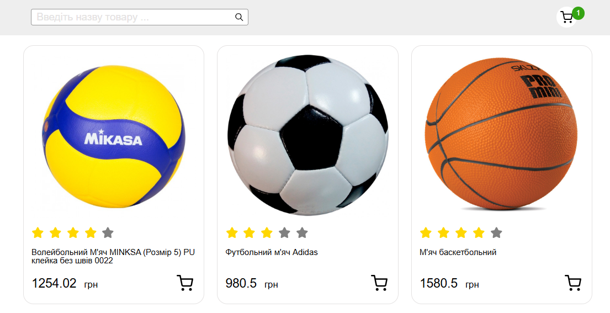

# Module Basket

  
 

🔗 Live Demo:  [Your GitHub Pages Link](https://alexsand-r.github.io/module-basket/)

This project was created using **Vite** and implements a simple page for working with a shopping cart. The page allows users to view products, add them to the cart, modify quantities, and filter products by name.

## 🛒 Features

- **Displaying Products**: The page loads a list of products and displays them on the screen.
- **Adding Products to the Cart**: Users can add a product to the cart by clicking the "Add to Cart" button.
- **Changing Product Quantity**: Users can adjust the quantity of a product in the cart using the "+" and "-" buttons. The total quantity and price are updated automatically.
- **Product Filtering**: A search feature allows users to filter products by name. Only products matching the search query are displayed.

## 🔧 Technologies Used

- **Vite**: For fast development and bundling.
- **HTML**: For the basic structure and layout of the website.
- **CSS**: For styling the page and ensuring a responsive design.
- **JavaScript**: For interactive functionalities like updating cart quantity and filtering products.

📫 Contact Me:
1inboxna@gmail.com

